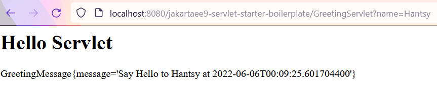
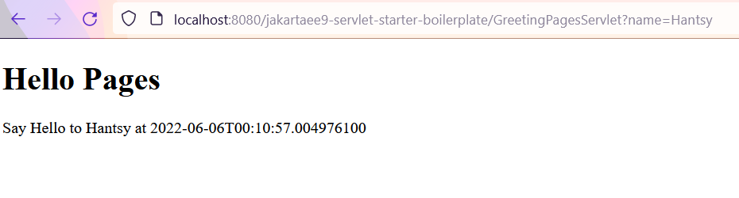
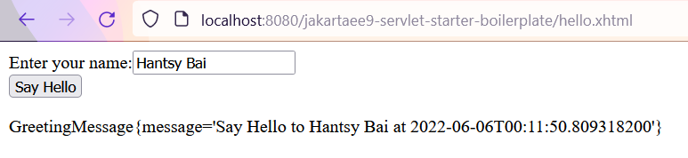
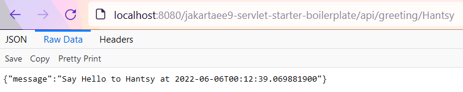

# Building a Jakarta EE 9 Web application with Servlet Containers

In Jakarta EE world, a lot of Java developers have built Java Web applications, but instead of using a full-fledged Application Servers, such as Payara, WildFly and WebLogic as production environments, they preferred to deploy into and run on a light-weight Servlet container, such as Apache Tomcat, Eclipse Jetty.

In the past years I have prepared [jakartaee8-starter-boilerplate](https://github.com/hantsy/jakartaee8-starter-boilerplate) and  [jakartaee9-starter-boilerplate](https://github.com/hantsy/jakartaee9-starter-boilerplate) to help develpers to start a new Jakarta EE project and deploy into the popular application servers. 
The newly created [jakartaee9-servlet-starter-boilerplate](https://github.com/hantsy/jakartaee9-servlet-starter-boilerplate) project provides a template to create Jakarta EE web applications and deploy to the popular Servlet containers, esp. Apache Tomcat 10.x and Eclipse Jetty 11.x. In this project, I have integrated the following popular Jakarta EE compoenents.

  * CDI 3.0 (Weld 4.0)
  * Jakarta REST 3.0(Jersey 3.0)
  * Jakarta Server Faces 3.0(Mojarra 3.0)
  * And transitive dependencies of above features, incuding Jakarta EL, Jarkarta Json Processing, Jakarta Json Binding, Jakarta Validation(Hibernate Validator), etc.

Nowadays the most popular Servlet containers, such as Apache Tomcat, Eclipse Jetty, etc. have built-in Jakarta Servlet, Jakarta Server Pages, JSTL, Jakarta EL and Jakarta WebSocket supports.

## Prerequisites 

Make sure you have installed the following softwares.

* JDK 11 or 17
* Apache Maven 3.8
* Apache Tomcat 10.x and Eclipse Jetty 11.x
* Intellij IDEA Communnity Edition or VSCode + Java Pack

Let's explore the integrated features in the [jakartaee9-servlet-starter-boilerplate](https://github.com/hantsy/jakartaee9-servlet-starter-boilerplate) repository.

## Configuration

To prepare a project used in the next stpes, clone the source codes of [jakartaee9-servlet-starter-boilerplate](https://github.com/hantsy/jakartaee9-servlet-starter-boilerplate) repository or create a new Maven webapp through [Maven Webapp Archetype](https://maven.apache.org/archetypes/maven-archetype-webapp/). 

### Jakarta Servlet 5.0

Apache Tomcat and Eclipse Jetty has built-in Jakarta Servlet, Jakarta Pages, Jakarta WebSocket implementation in the distribution bundle. 

But in the development stage, you could use these APIs in your project codes. 

Delcare `jakarta.jakartaee-bom` in the the `dependencyManagement` section.

```xml
<!-- https://mvnrepository.com/artifact/jakarta.platform/jakarta.jakartaee-bom -->
<dependency>
    <groupId>jakarta.platform</groupId>
    <artifactId>jakarta.jakartaee-bom</artifactId>
    <version>9.1.0</version>
    <type>pom</type>
</dependency>
```            
And add the following dependencies in the project `dependencies` section.

```xml
<dependency>
    <groupId>jakarta.servlet</groupId>
    <artifactId>jakarta.servlet-api</artifactId>
    <version>5.0.0</version>
    <scope>provided</scope>
</dependency>
<dependency>
    <groupId>jakarta.el</groupId>
    <artifactId>jakarta.el-api</artifactId>
    <version>4.0.0</version>
    <scope>provided</scope>
</dependency>
<dependency>
    <groupId>jakarta.servlet.jsp.jstl</groupId>
    <artifactId>jakarta.servlet.jsp.jstl-api</artifactId>
    <version>${jakarta.servlet.jsp.jstl.version}</version>
    <scope>provided</scope>
</dependency>

<dependency>
    <groupId>org.glassfish.web</groupId>
    <artifactId>jakarta.servlet.jsp.jstl</artifactId>
    <version>${jakarta.servlet.jsp.jstl.version}</version>
</dependency>

<dependency>
    <groupId>org.glassfish</groupId>
    <artifactId>jakarta.el</artifactId>
    <version>${jakarta.el.version}</version>
</dependency>

 <!-- Optional, only when <f:websocket> is used. -->
<!-- dependency>
    <groupId>org.glassfish</groupId>
    <artifactId>jakarta.json</artifactId>
    <version>${jakarta.json.version}</version>
</dependency -->

<dependency>
    <!-- Optional, only when <f:validateBean> or <f:validateWholeBean> is used. -->
    <groupId>org.hibernate.validator</groupId>
    <artifactId>hibernate-validator</artifactId>
    <version>${hibernate-validator.version}</version>
</dependency>
```

The `jakarta.json` and `hibernate-validator` are optional, add them when they are required.

Create an empty *src/main/webapp/WEB-INF/web.xml*.

```xml
<?xml version="1.0" encoding="UTF-8"?>

<web-app version="5.0"
         xmlns="https://jakarta.ee/xml/ns/jakartaee"
         xmlns:xsi="http://www.w3.org/2001/XMLSchema-instance"
         xsi:schemaLocation="https://jakarta.ee/xml/ns/jakartaee https://jakarta.ee/xml/ns/jakartaee/web-app_5_0.xsd">
</web-app> 
```

Note the XML namespace are updated to use `[https://jakarta.ee/xml/ns/jakartaee](https://jakarta.ee/xml/ns/jakartaee)` in Jakarta EE 9.


### CDI 3.0

Weld 4.0 is compatable with CDI 3.0 specification, and Weld works with Apache Tomcat and Eclipse Jetty.

Add the following dependency.

```xml
<!-- Weld for CDI support -->
<dependency>
    <groupId>org.jboss.weld.servlet</groupId>
    <artifactId>weld-servlet-core</artifactId>
    <version>${weld.version}</version>
    <exclusions>
        <exclusion>
            <groupId>jakarta.el</groupId>
            <artifactId>jakarta.el-api</artifactId>
        </exclusion>
    </exclusions>
</dependency>
```

Create an empty *src/main/webapp/WEB-INF/beans.xml*.

```xml
<?xml version="1.0" encoding="UTF-8"?>
<beans xmlns="https://jakarta.ee/xml/ns/jakartaee"
       xmlns:xsi="http://www.w3.org/2001/XMLSchema-instance"
       xsi:schemaLocation="https://jakarta.ee/xml/ns/jakartaee https://jakarta.ee/xml/ns/jakartaee/beans_3_0.xsd"
       version="3.0">
</beans>
```

To make `BeanManager` avaiable via JNDI lookup. For Apache Tomcat, create a Resource in the application *context.xml*.

Create a `src/main/webapp/META-INF/context.xml`.

```xml
<?xml version="1.0" encoding="UTF-8"?>
<Context path="/jakartaee9-servlet-starter-boilerplate">
    <Resource name="BeanManager"
            auth="Container"
            type="jakarta.enterprise.inject.spi.BeanManager"
            factory="org.jboss.weld.resources.ManagerObjectFactory"/>
</Context>
```

The path is the application context path at runtime. Here it creates a Resource
`BeanManager`.

For Eclipse Jetty, create a *src/main/webapp/WEB-INF/jetty-env.xml*.

```xml
<?xml version="1.0" encoding="UTF-8"?>
<!DOCTYPE Configure PUBLIC "-//Jetty//Configure//EN" "https://www.eclipse.org/jetty/configure_10_0.dtd">
<Configure id="wac" class="org.eclipse.jetty.webapp.WebAppContext">
    <New id="BeanManager" class="org.eclipse.jetty.plus.jndi.Resource">
        <Arg>
            <Ref refid="wac"/>
        </Arg>
        <Arg>BeanManager</Arg>
        <Arg>
            <New class="javax.naming.Reference">
                <Arg>jakarta.enterprise.inject.spi.BeanManager</Arg>
                <Arg>org.jboss.weld.resources.ManagerObjectFactory</Arg>
                <Arg/>
            </New>
        </Arg>
    </New>
</Configure>
```

Add resource reference in the *web.xml*.

```xml
<resource-env-ref>
    <resource-env-ref-name>BeanManager</resource-env-ref-name>
    <resource-env-ref-type>
        jakarta.enterprise.inject.spi.BeanManager
    </resource-env-ref-type>
</resource-env-ref>
```

### Jakarta Rest(Jaxrs) 3.0

Jersey was the default JAX-RS implementation in Glassfish, now it is a standalone projet under Eclipse EE4J project. Besides, other popular JAX-RS implementations including Apache CXF, JBoss RestEasy, etc.

Add `jersey-bom` in the `dependencyManagement` section.

```xml
 <dependency>
    <groupId>org.glassfish.jersey</groupId>
    <artifactId>jersey-bom</artifactId>
    <version>${jersey.version}</version>
    <type>pom</type>
    <scope>import</scope>
</dependency>
```

Add the following dependencies.

```xml
<dependency>
    <groupId>org.glassfish.jersey.containers</groupId>
    <artifactId>jersey-container-servlet</artifactId>
</dependency>
<dependency>
    <groupId>org.glassfish.jersey.inject</groupId>
    <artifactId>jersey-hk2</artifactId>
</dependency>

<!-- see: https://github.com/eclipse-ee4j/jersey/blob/3.x/examples/cdi-webapp/pom.xml#L142 -->
<dependency>
    <groupId>org.glassfish.jersey.ext.cdi</groupId>
    <artifactId>jersey-cdi1x</artifactId>
</dependency>
<dependency>
    <groupId>org.glassfish.jersey.ext.cdi</groupId>
    <artifactId>jersey-cdi1x-servlet</artifactId>
</dependency>
<dependency>
    <groupId>org.glassfish.jersey.ext.cdi</groupId>
    <artifactId>jersey-cdi1x-ban-custom-hk2-binding</artifactId>
</dependency>

<dependency>
    <groupId>org.glassfish.jersey.media</groupId>
    <artifactId>jersey-media-json-binding</artifactId>
</dependency>
```

Jersey 3.0 is still dependent on HK2 which a small IOC container, and `jersey-media-json-binding` provides JSON searialzation and desearialization through Jakarta JSON binding. 

The Jersey support will be initialized when the Servlet container is starting up.

Similar to a general Jakarta EE application, add a simple `Application` class to activate Jakarta REST.

```java
@ApplicationPath("/api")
public class RestActivator extends Application {
    @Override
    public Set<Class<?>> getClasses() {
        return Set.of(GreetingResource.class);
    }
}
```

### Jakarta Server Faces 4.0

Mojarra is the most popular JSF implementation, another popular one is Apache MyFaces.

```xml
<!-- Jakarta Faces -->
<dependency>
    <groupId>org.glassfish</groupId>
    <artifactId>jakarta.faces</artifactId>
    <version>${jakarta.faces.version}</version>
</dependency>
```

Add an empty */src/main/webapp/WEB-INF/faces-config.xml*.

```xml
<?xml version="1.0" encoding="UTF-8"?>
<faces-config
        xmlns="https://jakarta.ee/xml/ns/jakartaee"
        xmlns:xsi="http://www.w3.org/2001/XMLSchema-instance"
        xsi:schemaLocation="https://jakarta.ee/xml/ns/jakartaee https://jakarta.ee/xml/ns/jakartaee/web-facesconfig_3_0.xsd"
        version="3.0">
    <!-- Put any faces config here. -->
</faces-config>
```
Since JSF 2.3, it add some CDI compatible features, such as the new scopes, etc. To enable the new features, create a simple configuration class to activate it.

```java
@FacesConfig(version = Version.JSF_2_3)
@ApplicationScoped
public class FacesCdiActivator {
}
```

## Examples

Next let's explore some examples of these specifications.

### Jakarta CDI Example

The following example is a simple CDI bean to build a greeting messsage. 

```java
@ApplicationScoped
public class GreetingService {
    private static final Logger LOGGER = Logger.getLogger(GreetingService.class.getName());
    
    public GreetingMessage buildGreetingMessage(String name) {
        var message = GreetingMessage.of("Say Hello to " + name + " at " + LocalDateTime.now());
        LOGGER.log(Level.INFO, "build message: {0}", message);
        return message;
    }
}
```

The `GreetingMessage` is a POJO class.

```java
@SuppressWarnings("serial")
public class GreetingMessage implements Serializable {

    private String message;

    public static GreetingMessage of(String s) {
        final var message = new GreetingMessage();
        message.setMessage(s);
        return message;
    }

    public String getMessage() {
        return message;
    }

    public void setMessage(String message) {
        this.message = message;
    }
    
    @Override
    public String toString() {
        return "GreetingMessage{" +
                "message='" + message + '\'' +
                '}';
    }
}
```

### Jakarta Servlet Example

In this Servlet class, we injected the existing `GreetingService` to handle the message.

```java
@WebServlet(urlPatterns = "/GreetingServlet")
public class GreetingServlet extends HttpServlet {
    private static final String PAGE_HEADER = "<html><head><title>Jakarta Servlet Example</title></head><body>";
    private static final String PAGE_FOOTER = "</body></html>";
    
    @Inject
    private GreetingService greetingService;
    
    protected void doGet(HttpServletRequest req, HttpServletResponse resp) throws IOException {
        var name = req.getParameter("name");
        resp.setContentType("text/html");
        var writer = resp.getWriter();
        writer.println(PAGE_HEADER);
        
        // write message to http response
        writer.println("<h1> Hello Servlet </h1>");
        writer.println("<p>" + greetingService.buildGreetingMessage(name) + "</p>");
        
        writer.println(PAGE_FOOTER);
        writer.close();
    }
    
}
```

### Jakarta Servlet and Pages Example

Refactor the above the example, split page view part into a standalone Pages file.

```java
@WebServlet(urlPatterns = "/GreetingPagesServlet")
public class GreetingPagesServlet extends HttpServlet {

    @Inject
    private GreetingService greetingService;

    protected void doGet(HttpServletRequest req, HttpServletResponse resp) throws IOException, ServletException {
        var name = req.getParameter("name");
        var message = greetingService.buildGreetingMessage(name);
        req.setAttribute("hello", message);
        req.getRequestDispatcher("/hello-pages.jspx").forward(req, resp);
    }

}
```
Put the message object into request attribute, in the pages view, it can be read from requestScope directive.

```html
<?xml version="1.0" encoding="UTF-8" ?>
<jsp:root xmlns:jsp="http://java.sun.com/JSP/Page"
          xmlns="http://www.w3.org/1999/xhtml"
          version="2.0">
    <jsp:directive.page contentType="text/html; charset=UTF-8"
                        pageEncoding="UTF-8"
                        session="false"/>
    <jsp:output omit-xml-declaration="true"/>
    <!-- make it HTML 5 declaration compatiable -->
    <![CDATA[<!DOCTYPE html>]]>
    <html>
    <head><title>Jakarta Server Pages Example</title></head>
    <body>
        <h1>Hello Pages</h1>
        <p>${requestScope.hello.message}</p>
    </body>
    </html>
</jsp:root>
```

### Jakarta Faces Example

Create a Jakarta Faces backend bean, it is a CDI bean.

```java
@Named
@RequestScoped
public class Hello {
    
    private String name;
    private GreetingMessage message;
    
    @Inject
    private GreetingService greetingService;
    
    public Hello() {
    }
    
    public Hello(GreetingService greetingService) {
        this.greetingService = greetingService;
    }
    
    public void createMessage() {
        message = greetingService.buildGreetingMessage(name);
    }
    
    public String getName() {
        return name;
    }
    
    public void setName(String name) {
        this.name = name;
    }
    
    public GreetingMessage getMessage() {
        return message;
    }
    
}
```

Let's have a look at the *hello.xhtml*.

```html
<!DOCTYPE html>
<html lang="en"
      xmlns="http://www.w3.org/1999/xhtml"
      xmlns:f="http://xmlns.jcp.org/jsf/core"
      xmlns:jsf="http://xmlns.jcp.org/jsf"
      xmlns:h="http://xmlns.jcp.org/jsf/html">
<f:view>
    <h:head>
        <title>Hello, World!</title>
    </h:head>
    <h:body>
        <h:form prependId="false">
            <label jsf:for="name" jsf:required="true">Enter your name:</label>
            <input type="text"
                   jsf:id="name"
                   jsf:value="#{hello.name}"
                   jsf:required="true"
                   jsf:requiredMessage="Name is required."
                   placeholder="Type your name here..."
            />
            <h:message for="name"/>
            <br/>
            <input type="submit" jsf:id="submit" value="Say Hello"  jsf:action="#{hello.createMessage()}">
                <f:ajax execute="@form" render="@form"/>
            </input>
            <br/>
            <p id="message">#{hello.message}</p>
        </h:form>
    </h:body>
</f:view>
</html>
```

### Jakarta REST Example

In this example, we reuse the `GreetingService` bean to handle the greeting message.

```java
@Path("greeting")
@RequestScoped
public class GreetingResource {

    @Inject
    private GreetingService greetingService;

    @GET
    @Path("{name}")
    @Produces(MediaType.APPLICATION_JSON)
    public Response greeting(@PathParam("name") String name) {
        return ok(this.greetingService.buildGreetingMessage(name)).build();
    }
}
```

## Run the application

To deploy an application to the production environment, firstly we can package the built files into a `war` archive, and put it into a deployable folder under the servlet container. Then start up the servlet container, the war file will be detected and deployed into the servlet container.

To simplify the deployment in the development stage, we use maven plugins to complete the work.

### Deploying to Apache Tomcat

To deploy the application into Apache Tomcat, we use `cargo-maven3-plugin`.

```xml
<build>
    <plugins>
        ...
        <plugin>
            <groupId>org.codehaus.cargo</groupId>
            <artifactId>cargo-maven3-plugin</artifactId>
            <configuration>
                <container>
                    <containerId>tomcat10x</containerId>
                    <artifactInstaller>
                        <groupId>org.apache.tomcat</groupId>
                        <artifactId>tomcat</artifactId>
                        <version>${tomcat.version}</version>
                    </artifactInstaller>
                </container>

                <configuration>
                    <properties>
                        <!-- <cargo.servlet.port>8080</cargo.servlet.port>-->
                        <cargo.logging>low</cargo.logging>
                    </properties>
                </configuration>
            </configuration>
        </plugin>
    </plugins>
</build>
```

The `cargo-maven3-plugin` controls the lifecyle of Tomcat starting and stopping.

Run the following command to run application on Tomcat.

```bash 
mvn clean package cargo:run
```

When it is started, open your browser, check the examples we have created above.

Go to http://localhost:8080/jakartaee9-servlet-starter-boilerplate/GreetingServlet?name=Hantsy to view the Servlet example.



Open http://localhost:8080/jakartaee9-servlet-starter-boilerplate/GreetingPagesServlet?name=Hantsy to see the result of Jakarta Server Pages. 



Navigate to http://localhost:8080/jakartaee9-servlet-starter-boilerplate/hello.xhtml and input name, and click the Greeting button, you will see the following result. 



Access http://localhost:8080/jakartaee9-servlet-starter-boilerplate/api/greeting/Hantsy in your browser or using `curl` command, you will see the following result.



Similarly, we can also configure cargo to use Eclipse Jetty as servlet container. But Eclipse Jetty provides an official maven plugin for deploying applications into Jetty servers.

### Deploying to Eclipse Jetty

In Jetty 11.x, Jetty maven plugin was refactored, and provides 3 deploy modes in the new pluign.

* EMBED
* FORKED
* EXTERNAL

The default mode is `EMBED` which is similar to running the simplest `jetty:run` goal in the previous version.

The `FORKED` mode uses a forked thread to run the application.

The `EXTERNAL` mode runs the application on an external standalone Jetty server.

#### Deploying to an Embedded Jetty Server

Configure jetty maven plugin and use EMBED mode.

```xml
<profile>
    <id>jetty-embed</id>
    <build>
        <plugins>
            <plugin>
                <groupId>org.eclipse.jetty</groupId>
                <artifactId>jetty-maven-plugin</artifactId>
                <configuration>
                    <deployMode>EMBED</deployMode>
                    <useProvidedScope>true</useProvidedScope>
                    <httpConnector>
                        <port>9090</port>
                    </httpConnector>
                </configuration>
            </plugin>
        </plugins>
    </build>
    <dependencies>
        <dependency>
            <groupId>org.glassfish.web</groupId>
            <artifactId>jakarta.servlet.jsp.jstl</artifactId>
            <version>${jakarta.servlet.jsp.jstl.version}</version>
            <scope>provided</scope>
        </dependency>
        <dependency>
            <groupId>org.glassfish</groupId>
            <artifactId>jakarta.json</artifactId>
            <version>${jakarta.json.version}</version>
            <scope>provided</scope>
        </dependency>
        <dependency>
            <groupId>jakarta.el</groupId>
            <artifactId>jakarta.el-api</artifactId>
            <version>4.0.0</version>
            <scope>provided</scope>
        </dependency>

        <dependency>
            <groupId>org.eclipse.jetty</groupId>
            <artifactId>jetty-servlet</artifactId>
            <scope>provided</scope>
        </dependency>
        <dependency>
            <groupId>org.eclipse.jetty</groupId>
            <artifactId>jetty-plus</artifactId>
            <scope>provided</scope>
        </dependency>
        <dependency>
            <groupId>org.eclipse.jetty</groupId>
            <artifactId>jetty-annotations</artifactId>
            <scope>provided</scope>
        </dependency>
        <dependency>
            <groupId>org.eclipse.jetty</groupId>
            <artifactId>jetty-webapp</artifactId>
            <scope>provided</scope>
        </dependency>
        <dependency>
            <groupId>org.eclipse.jetty</groupId>
            <artifactId>jetty-cdi</artifactId>
            <version>${jetty.version}</version>
            <scope>provided</scope>
        </dependency>
        <dependency>
            <groupId>org.slf4j</groupId>
            <artifactId>slf4j-simple</artifactId>
            <version>1.7.36</version>
        </dependency>
    </dependencies>
</profile>
```

There is `useProvidedScope` option, when it is true, it will use *provided* scoped dependencies in container classpath to run the application. 

> Here, if I disable it, it will cause failure to run the application.

Run the following command to deploy the application into an embedded Jetty.

```bash 
mvn clean jetty:run -Pjetty-embed
```

#### Deploying to an External Jetty Server

Create a new Maven profile for this purpose.

```xml
<profile>
    <id>jetty-external</id>
    <build>
        <plugins>
            <plugin>
                <groupId>org.eclipse.jetty</groupId>
                <artifactId>jetty-maven-plugin</artifactId>
                <configuration>
                    <deployMode>EXTERNAL</deployMode>
                    <webApp>
                        <contextPath>/${project.artifactId}</contextPath>
                    </webApp>
                    <jettyHome>${env.JETTY_HOME}</jettyHome>
                    <modules>jdni,jsp,servlet,glassfish-jstl,websocket-jakarta,cdi-decorate</modules>
                </configuration>
            </plugin>
        </plugins>
    </build>
    <dependencies>
        <dependency>
            <groupId>org.glassfish.web</groupId>
            <artifactId>jakarta.servlet.jsp.jstl</artifactId>
            <version>${jakarta.servlet.jsp.jstl.version}</version>
            <scope>provided</scope>
        </dependency>
        <dependency>
            <groupId>org.glassfish</groupId>
            <artifactId>jakarta.json</artifactId>
            <version>${jakarta.json.version}</version>
            <scope>provided</scope>
        </dependency>
        <dependency>
            <groupId>jakarta.el</groupId>
            <artifactId>jakarta.el-api</artifactId>
            <version>4.0.0</version>
            <scope>provided</scope>
        </dependency>
    </dependencies>
</profile>
```
Make sure you have downloaded a copy of Eclipse Jetty, and create an system environment variable `JETTY_HOME`  and set it to the location of Eclipse Jetty folder.

Run the following command to deploy the application into an embedded Jetty.

```bash 
mvn clean jetty:run -Pjetty-external
```

Check [the complete example codes](https://github.com/hantsy/jakartaee9-servlet-starter-boilerplate) from My Github.